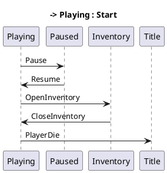

# Day 226 · 处理多个元游戏模式

> 游戏不是单一模式——有标题画面、菜单、玩游戏中、过场、暂停、设置。这些是"metagame modes"。今天 casey 设计状态机:每个 mode 独立 update / render,切换时正确清理 + 初始化。

## 0 · 为什么要有这一天

之前游戏的"模式"散在各处 if-else:

```rust
fn game_update(state: &mut GameState) {
    if state.in_menu {
        update_menu(state);
    } else if state.in_game {
        update_game(state);
    } else if state.paused {
        update_pause_menu(state);
    }
    // ...
}
```

每加一个 mode,改这个大函数,改各处分支。**代码味道 (code smell)**:switch-on-type。

**casey 今天的方案**:正式引入 **mode 概念**:

```rust
enum MetagameMode {
    Title,
    MainMenu,
    InGame,
    Paused,
    Settings,
    Cutscene,
}

struct GameState {
    mode: MetagameMode,
    // ... 各 mode 独立数据
}
```

每个 mode 有独立 update / render 函数。切换 mode 时显式:

```rust
fn transition(state: &mut GameState, new_mode: MetagameMode) {
    cleanup(state, &state.mode);
    state.mode = new_mode;
    initialize(state, &new_mode);
}
```

这是状态机 (state machine) 模式,游戏开发标准做法。

心理锚点:看完今天,你能解释"为什么超级马里奥有 overworld / level / pause 三个 mode",并设计自己的 mode 切换。

## 1 · Casey 今天做了什么

1. **加 MetagameMode enum**:列出所有 mode
2. **加 mode-specific update / render**:`update_title`, `update_in_game`, ...
3. **加 transition 函数**:显式切换,带 cleanup / init
4. **加 mode stack**:暂停时压栈,恢复时弹栈

## 2 · 心智模型

### 类比:剧场剧目

剧场演出有多幕:

- 幕 1:开场
- 幕 2:第一场
- 幕 3:中场休息
- 幕 4:第二场
- 幕 5:谢幕

每幕独立道具、独立演员调度。换幕时上一幕清场、下一幕布景。

casey 的 metagame mode 就是剧场的幕。`InGame` 是"第二场",`Paused` 是"中场休息"。切换时类似换幕:cleanup 上一幕、init 下一幕。

### 2.1 Mode enum

```rust
#[derive(Copy, Clone, Debug, PartialEq, Eq)]
enum MetagameMode {
    Booting,
    Title,
    MainMenu,
    InGame,
    Paused,
    Settings,
    Cutscene,
    Quitting,
}
```

每个 variant 表达一种"游戏整体状态"。casey 的 HH 包含 Booting(加载阶段)、Title(标题画面)、InGame(实际玩)、Paused(暂停)等。

### 2.2 Mode 数据

mode 自己的数据可以放在 enum variant 里:

```rust
enum MetagameMode {
    Title { time_in_title: f32 },
    InGame { level_id: u32, score: u32 },
    Paused { pause_time: f32 },
    ...
}
```

或者:

```rust
enum MetagameMode { Title, InGame, Paused }

struct GameState {
    mode: MetagameMode,
    title: TitleState,
    in_game: InGameState,
    paused: PauseState,
}
```

casey 选第二种(所有 mode 数据并存,只激活当前 mode 的)。简单,但内存占用是所有 mode 之和。如果某些 mode 数据大(过场动画资源),可以用 Box 惰性分配。

### 2.3 Mode 栈

暂停时,游戏状态不丢——而是把 InGame 压栈,顶上叠 Paused:

```rust
struct GameState {
    mode_stack: Vec<MetagameMode>,
}

impl GameState {
    fn current(&self) -> Option<&MetagameMode> {
        self.mode_stack.last()
    }

    fn push(&mut self, mode: MetagameMode) {
        self.mode_stack.push(mode);
    }

    fn pop(&mut self) -> Option<MetagameMode> {
        self.mode_stack.pop()
    }
}
```

启动:
- push(Booting) → push(Title) → push(MainMenu) → push(InGame)
- 玩家按 Esc → push(Paused)
- 玩家按 Resume → pop()(回到 InGame)

栈顶决定 update 哪个 mode。

### 2.4 Update 分发

```rust
fn update(state: &mut GameState, dt: f32) {
    match state.current() {
        Some(MetagameMode::Booting) => update_booting(state, dt),
        Some(MetagameMode::Title) => update_title(state, dt),
        Some(MetagameMode::MainMenu) => update_main_menu(state, dt),
        Some(MetagameMode::InGame) => update_in_game(state, dt),
        Some(MetagameMode::Paused) => update_paused(state, dt),
        Some(MetagameMode::Quitting) => update_quitting(state, dt),
        None => panic!("No mode in stack"),
    }
}
```

Rust 的 `match` 强制穷尽,加新 mode 编译报错——保证所有分支都处理。

### 2.5 Transition

```rust
fn transition_to(state: &mut GameState, new_mode: MetagameMode) {
    let old_mode = state.mode_stack.pop().unwrap();
    cleanup(state, old_mode);
    initialize(state, new_mode);
    state.mode_stack.push(new_mode);
}

fn transition_push(state: &mut GameState, new_mode: MetagameMode) {
    initialize(state, new_mode);
    state.mode_stack.push(new_mode);
}

fn transition_pop(state: &mut GameState) {
    if let Some(old) = state.mode_stack.pop() {
        cleanup(state, old);
    }
}
```

三种 transition:

- **Replace**(to):换 mode,栈深度不变
- **Push**:叠加新 mode,栈 +1
- **Pop**:弹栈,栈 -1

casey 在不同场景用不同 transition:

- Title → MainMenu → InGame:用 Replace(不回头)
- InGame → Paused:用 Push(暂停后回 InGame)
- Paused → InGame:用 Pop

## 3 · 四域深入

### 3.1 · 游戏编程视角

metagame mode 是游戏开发的标准:

- **Unreal**:UGameMode + UGameState,切换 level 时改 GameMode
- **Unity**:SceneManager,加载 scene 切换 mode
- **Godot**:SceneTree,change_scene 切换

casey 的 metagame mode 是简化版,但思想一致。

### 3.2 · Linux 系统编程视角

Linux 进程也有"模式":

- **systemd**:target / unit 状态(active / inactive / failed)
- **SSH server**:connection state(established / authenticated / closed)
- **Web server**:request state(waiting / reading / processing / writing)

所有这些都是状态机。casey 的 metagame mode 是游戏机的版本。

### 3.3 · Rust 生态视角

Rust 表达状态机:

```rust
// Pattern 1:enum + match(casey 风格)
enum Mode { ... }
fn update(s: &mut State, m: Mode) { match m { ... } }

// Pattern 2:Type-state pattern
struct State<Boot>; struct State<Title>; struct State<InGame>;
// 每个 type 是不同 mode,编译时保证转换合法

// Pattern 3:crate
use statig::StateMachine;
```

casey 用 Pattern 1,游戏开发通用。Pattern 2 是 Rust 进阶(类型级状态机),适合更严格的场景(协议状态)。

### 3.4 · 测试视角

模式切换是 bug 高发区。测试:

```rust
#[test]
fn transition_in_game_to_paused() {
    let mut s = GameState::new();
    s.push(MetagameMode::InGame);
    s.push(MetagameMode::Paused);
    assert_eq!(s.current(), Some(&MetagameMode::Paused));
    s.pop();
    assert_eq!(s.current(), Some(&MetagameMode::InGame));
}

#[test]
fn quitting_cleans_up() {
    let mut s = GameState::new();
    s.push(MetagameMode::InGame);
    s.push(MetagameMode::Quitting);
    // transition_to quitting 应该清理 InGame 资源
    // 验证资源被释放
}
```

## 4 · 认知地图

### 4.1 上级

- **State machine** — 状态机模式
- **Game mode management** — 游戏 mode 管理
- **Mode stack** — 模式栈(暂停 / 恢复)

### 4.2 同级

| 方案 | 关键差别 |
|---|---|
| 大 if-else | 简单、难维护 |
| Mode enum + match | 显式、可扩展 |
| ECS-driven mode | 数据驱动 |
| Coroutine-based | 玩家"代码"自己管 mode |

### 4.3 下级

- **MetagameMode enum** — mode 列表
- **mode_stack** — 暂停栈
- **transition_to / push / pop** — 切换 API
- **cleanup / initialize** — 切换时清理

## 5 · 对照与变奏

状态机不同领域:

- **Compiler parser**:lex / parse 状态
- **Network protocol**:TCP 状态机(11 个状态)
- **UI wizard**:多步表单
- **Vending machine**:投入硬币 → 选择 → 出货

所有这些都是"有限状态机 (FSM)"实例。casey 的 metagame 是 FSM。

## 6 · 关联 Day

- **铺垫**:[day223](day223.md) 多 cutscene、[day225](day225.md) 淡入淡出
- **当天**:day226
- **后续**:[day227](day227.md) mode 之间切换、[day228](day228.md) 等待依赖任务

## 7 · 变式训练

### Lv1 · 概念辨析

**题**:为什么用 mode stack 而不是单个 mode 变量?

**参考解答**:单 mode 变量在暂停时,要么丢掉 InGame 状态(Paused 后回不到原 InGame),要么手动保存到外置变量(混乱)。mode stack 自动:Paused 压栈,InGame 在底下保留。pop 后回到 InGame,状态完全保留。这是"用栈表达层级关系"的标准模式。

### Lv2 · 动手实践

**题**:实现 GameState + mode_stack + transition API。测试 InGame → Paused → InGame 的栈操作。

**参考解答**:

```rust
#[derive(Copy, Clone, Debug, PartialEq, Eq)]
enum Mode { Booting, Title, MainMenu, InGame, Paused, Quitting }

struct GameState {
    mode_stack: Vec<Mode>,
    frame_count: u32,
}

impl GameState {
    fn new() -> Self { Self { mode_stack: vec![Mode::Booting], frame_count: 0 } }

    fn current(&self) -> Mode { *self.mode_stack.last().unwrap() }

    fn transition_to(&mut self, m: Mode) {
        let old = self.mode_stack.pop().unwrap();
        println!("Cleanup {:?}", old);
        println!("Init {:?}", m);
        self.mode_stack.push(m);
    }

    fn push(&mut self, m: Mode) {
        println!("Push {:?}", m);
        self.mode_stack.push(m);
    }

    fn pop(&mut self) {
        if let Some(old) = self.mode_stack.pop() {
            println!("Pop {:?}", old);
        }
    }
}

fn main() {
    let mut s = GameState::new();
    println!("Initial: {:?}", s.current());

    s.transition_to(Mode::Title);
    s.transition_to(Mode::MainMenu);
    s.transition_to(Mode::InGame);
    println!("Stack: {:?}", s.mode_stack);

    println!("\nPause:");
    s.push(Mode::Paused);
    println!("Current: {:?}", s.current());

    println!("\nResume:");
    s.pop();
    println!("Current: {:?}", s.current());

    println!("\nQuit:");
    s.transition_to(Mode::Quitting);
    println!("Final stack: {:?}", s.mode_stack);
}
```

### Lv3 · 迁移设计

**题**:设计一个 TCP 协议状态机(11 状态),实现握手 / 数据传输 / 关闭的状态转移。

提示:RFC 793 定义的状态:CLOSED / LISTEN / SYN_SENT / SYN_RECEIVED / ESTABLISHED / FIN_WAIT_1 / FIN_WAIT_2 / TIME_WAIT / CLOSE_WAIT / LAST_ACK / CLOSING。

### Lv4 · 开源贡献

**题**:`statig` 是 Rust 状态机 crate。

GitHub: https://github.com/minedevnews/statig

读源码,提一个 doc 改进。

## 8 · Rust / Arch 落地代码

(见 Lv2)

```bash
cd /tmp && cargo new --bin day226 && cd day226
cargo run --release

# 看 systemd 的状态机
systemctl status
systemctl list-units --type=service | head
# ACTIVE 列就是 unit 的"mode"
```

## 10 · 深入:游戏状态机的设计模式

casey 今天引入"meta game modes"——游戏同时有 title screen / playing / pause menu / inventory 等多种 mode,要根据当前 mode 切换行为。这是状态机(state machine)在游戏开发的应用。让我们把它彻底讲透。

### 10.1 状态机的数学定义

状态机是 5 元组 `(S, Σ, δ, s_0, F)`:

- `S`:状态集合(title / playing / pause / inventory)
- `Σ`:输入字母表(player input、cutscene end、etc.)
- `δ: S × Σ → S`:转移函数
- `s_0`:初始状态(title)
- `F`:接受状态(在游戏中通常是"退出")

casey 的简化:
- 4 个 mode:title、playing、cutscene、menu
- 转移:按键、cutscene 结束、玩家死亡
- 初始:title screen

### 10.2 状态机的实现方式

**方式 1:enum + match**(Rust 惯用)

```rust
enum GameMode {
    Title,
    Playing,
    Paused,
    Cutscene(CutsceneId),
    Inventory,
}

fn update(state: &mut GameState, dt: f32) {
    match state.mode {
        GameMode::Title => update_title(state, dt),
        GameMode::Playing => update_playing(state, dt),
        GameMode::Paused => update_paused(state, dt),
        GameMode::Cutscene(id) => update_cutscene(state, dt, id),
        GameMode::Inventory => update_inventory(state, dt),
    }
}

fn transition(state: &mut GameState, input: Input) {
    state.mode = match (state.mode, input) {
        (GameMode::Title, Input::Start) => GameMode::Playing,
        (GameMode::Playing, Input::Pause) => GameMode::Paused,
        (GameMode::Paused, Input::Resume) => GameMode::Playing,
        (GameMode::Playing, Input::OpenInventory) => GameMode::Inventory,
        // ... 其他转移
        (current, _) => current,  // 默认不变
    };
}
```

优点:类型安全,编译器检查穷尽。缺点:N×M 转移表,大状态机累赘。

**方式 2:函数指针表**(C 风格)

```c
typedef void (*UpdateFn)(GameState*);
UpdateFn updates[] = {
    update_title, update_playing, update_paused, update_cutscene, update_inventory,
};
void update(GameState* s) { updates[s->mode](s); }
```

优点:数据驱动,可运行时改。缺点:类型不安全,易错。

**方式 3:状态对象**(OOP,GoF State pattern)

```rust
trait GameStateObj {
    fn update(&self, state: &mut GameState, dt: f32);
    fn handle_input(&self, state: &mut GameState, input: Input);
    fn on_enter(&self, state: &mut GameState);
    fn on_exit(&self, state: &mut GameState);
}

struct TitleScreen;
struct Playing;

impl GameStateObj for TitleScreen {
    fn update(&self, state: &mut GameState, dt: f32) { /* ... */ }
    fn on_enter(&self, state: &mut GameState) {
        state.audio.play_music("title_theme");
    }
    // ...
}

// 切换状态
state.current_mode = Box::new(Playing);
state.current_mode.on_enter(state);
```

优点:每个状态封装自己的逻辑,易扩展。缺点:动态分发,虚函数表开销。

**方式 4:状态机库(Rust crates)**

```rust
use statig::StateMachine;

#[derive(StateMachine)]
enum GameMode {
    Title { /* state */ },
    Playing { /* state */ },
    // ...
}
// statig 自动生成转移逻辑
```

优点:声明式,编译时验证。缺点:学习曲线。

casey 选方式 1(enum + match),因为 Rust 惯用、类型安全。HH 的状态少(5 个),方式 1 完全够。

### 10.3 状态机 vs 行为树

游戏 AI 通常不用状态机,用**行为树**(Behavior Tree, BT)。两者区别:

**状态机**:
- 当前在某个 state
- 事件触发转移
- 适合"反应式"逻辑(菜单、模式切换)

**行为树**:
- 树形结构,从根遍历
- 每个 node 返回 Success / Failure / Running
- 适合"决策式"逻辑(AI 选择行为)

casey 的 meta game mode 用状态机(反应式)。HH 的 AI(敌人)也用状态机,简单。商业游戏 AI(AI 对手)用 BT,复杂决策。

### 10.4 状态机的可视化

复杂状态机难维护。可视化工具帮助:

- **Graphviz**:从代码生成 dot 图
- **PlantUML**:文本描述 UML 状态图
- **Stately**:专门的状态机可视化库



输出 png 图,看一眼就懂。

### 10.5 工业级游戏状态机

商业游戏的状态机要 scale 到几十个 state:

- **Unreal**:`UGameMode` + `UPlayerState` + `UGameInstance` 三层
- **Unity**:`SceneManager` + custom state machine
- **Bevy**:`bevy_state` crate,通过 ECS 系统过滤

casey 的 HH 停在 5 个 state,够用。商业项目要按规模选方案。

### 10.6 状态持久化

mode 切换时,旧 state 的数据要保存(玩家暂停时,游戏数据不能丢)。casey 的方案:

```rust
struct GameState {
    mode: GameMode,
    persistent: PersistentState,  // 不随 mode 变化
    mode_specific: ModeSpecific,  // 当前 mode 的状态
}

enum ModeSpecific {
    Title(TitleData),
    Playing(PlayingData),
    // ...
}

fn transition_to_pause(state: &mut GameState) {
    // 保留 mode_specific::Playing 的数据,但 mode 变 Paused
    if let ModeSpecific::Playing(_) = &state.mode_specific {
        state.mode = GameMode::Paused;
        // mode_specific 不变,playing 数据保留
    }
}
```

这个细节在 casey 视频里有讨论。状态持久化是状态机系统设计的核心,新手常踩坑。

### 10.7 测试状态机

状态机的测试:

```rust
#[test]
fn test_pause_resume() {
    let mut s = GameState::new();
    s.mode = GameMode::Playing;
    transition(&mut s, Input::Pause);
    assert!(matches!(s.mode, GameMode::Paused));
    transition(&mut s, Input::Resume);
    assert!(matches!(s.mode, GameMode::Playing));
}

#[test]
fn test_invalid_transition() {
    let mut s = GameState::new();
    s.mode = GameMode::Title;
    // Title 状态下不能直接 pause
    transition(&mut s, Input::Pause);
    assert!(matches!(s.mode, GameMode::Title));  // 不变
}
```

每个转移都要测试。casey 在 HH 视频里手动测试,生产项目要写 unit test。

### 10.8 教学总结

day226 的核心要点:

1. **状态机是反应式系统**:输入触发转移
2. **Rust enum 适合状态机**:类型安全,match exhaustive
3. **数据持久化要设计**:mode_specific vs persistent
4. **可视化辅助维护**:Graphviz / PlantUML
5. **测试每个转移**:unit test 全覆盖

casey 给教学基础,生产项目要考虑状态机库(statig)或 ECS 模式(bevy_state)。

## 11 · 深入:游戏 meta-mode 的设计

casey 的"meta game mode"——title / playing / cutscene / menu / inventory——是游戏 UX 流程的核心抽象。让我们把它放到行业 context 里讨论。

### 11.1 游戏 UX 流程的标准模式

几乎所有游戏都有这种 meta-mode 流程:

```
Title → (New Game / Continue) → Playing → Pause Menu → (Resume / Quit) → Playing
                                                ↓
                                          Save & Quit → Title
```

复杂游戏加更多 mode:

- **Inventory**:管理装备
- **Skill Tree**:升级技能
- **Map**:查看世界地图
- **Dialogue**:NPC 对话
- **Combat**:战斗模式(可能是 sub-mode of Playing)
- **Crafting**:合成系统

casey 的 HH 5-6 个 mode 是中等规模。商业 RPG / 动作游戏 10-20 个 mode,需要更复杂管理。

### 11.2 模式栈(mode stack)

某些 mode 是"模态的"(modal)——暂停底层,显示 UI 在上面。casey 的 Pause 是模态——Playing 暂停,Pause Menu 显示。Resume 后回到 Playing。

实现方式:**模式栈**。

```rust
struct GameState {
    mode_stack: Vec<GameMode>,  // 栈顶是当前 mode
}

fn push_mode(state: &mut GameState, mode: GameMode) {
    state.mode_stack.push(mode);
}

fn pop_mode(state: &mut GameState) -> Option<GameMode> {
    state.mode_stack.pop()
}

fn update(state: &mut GameState, dt: f32) {
    // 只 update 栈顶
    if let Some(current) = state.mode_stack.last() {
        update_mode(state, dt, current);
    }
}
```

Pause 流程:
- push_mode(Playing)
- push_mode(PauseMenu)  // Playing 不再 update,只 update PauseMenu
- pop_mode()  // 回到 Playing

### 11.3 多 mode 同时活跃

某些场景需要多 mode 同时活跃:

- **HUD overlay**:Playing 时也显示 HUD(生命、地图)
- **Cutscene with subtitles**:Cutscene 时显示字幕 UI
- **Picture-in-picture**:主视图 + 小窗口

实现:**多层 mode**(layered mode)。

```rust
struct GameState {
    layers: Vec<ModeLayer>,  // 从底到顶
}

struct ModeLayer {
    mode: GameMode,
    transparent: bool,  // true = 不阻塞下层
}
```

casey 的 HH 简化用单 mode + overlay。生产 UI 系统(Unity Canvas、Unreal UMG)支持多层。

### 11.4 mode 之间的资源管理

每个 mode 用不同资源:

- **Title**:title 背景 + 音乐
- **Playing**:游戏关卡 + 敌人 + 玩家
- **Pause**:pause menu UI

切换 mode 时,旧 mode 资源释放,新 mode 资源加载。这是 day224 streaming 系统的延伸——mode-level streaming。

```rust
fn transition(state: &mut GameState, new_mode: GameMode) {
    // 释放旧 mode 资源
    unload_mode_assets(state, &state.mode);
    // 加载新 mode 资源
    load_mode_assets(state, &new_mode);
    state.mode = new_mode;
}
```

mode 切换可能有 loading screen(同步加载)或无感切换(预取 + 异步)。casey 用前者(简单)。

### 11.5 模式化的输入处理

不同 mode 接收不同输入:

```rust
fn handle_input(state: &mut GameState, input: Input) {
    match state.mode {
        GameMode::Title => {
            // 只接收 Start 键
            if let Input::Start = input { transition(state, GameMode::Playing); }
        }
        GameMode::Playing => {
            // 接收所有游戏输入
            state.player_input.push(input);
        }
        GameMode::Paused => {
            // 只接收 Resume / Quit
            if let Input::Resume = input { transition(state, GameMode::Playing); }
        }
    }
}
```

casey 在 day227 详细讨论这个——"如何让 input 不被错误 mode 接收"。

### 11.6 工业级 meta-game 框架

商业游戏的 meta-game 框架:

- **Unreal GameFlow**:UGameMode + UGameSession + UPlayerController
- **Unity Game Flow**:SceneManager + ScriptableObject state
- **Godot SceneTree**:节点树天然支持 mode 切换
- **Bevy States**:Plugin-level state 切换

casey 的 HH 自定义 meta-mode 系统,教学清晰。生产项目用引擎内置框架。

### 11.7 教学总结

day226 的核心要点:

1. **状态机表达 meta-game**:清晰、可扩展
2. **mode 栈支持模态**:Pause / Menu 这类 overlay
3. **资源按 mode 管理**:切换时加载/卸载
4. **输入按 mode 过滤**:避免错误响应
5. **可视化测试**:状态图辅助调试

学完 day226,你能设计自己的游戏 meta-mode 系统。casey 给教学基础,看商业引擎 GameMode / SceneManager 不再陌生。

### 11.8 状态机迁移的实战案例

设想你接手一个 5 万行的 Rust 游戏项目,所有 mode 逻辑混在 `update()` 函数里:

```rust
fn update(state: &mut State, dt: f32) {
    // 800 行混合 title + playing + pause + inventory 逻辑
    // 各种 if state.is_title && ... else if state.is_playing && ...
}
```

如何迁移到状态机?

**步骤 1:识别 state**。grep 代码,找所有 `state.is_*` 判断。HH 项目典型 5-10 个 mode。

**步骤 2:抽 enum**。把 bool flag 改成 enum:

```rust
// 旧
struct State { is_title: bool, is_playing: bool, is_paused: bool, ... }
// 新
enum Mode { Title, Playing, Paused, ... }
struct State { mode: Mode, ... }
```

**步骤 3:split update**。把 800 行 update 拆成 N 个 mode-specific 函数。

**步骤 4:测试**。每个 mode 行为不变,snapshot 测试验证。

迁移 PR 通常几千行,review 一周。但完成后代码可维护性提升 10 倍。这是 casey 在 day226 隐式教给我们的工程方法——重构是渐进而非一蹴而就。

### 11.9 casey 风格的极简主义

casey 设计 meta-mode 系统的哲学是**极简**:

- 不用外部状态机库
- 不用 trait object
- 不用 dyn dispatch
- enum + match 解决所有问题

这与 bevy / Unreal / Unity 的"重型框架"截然相反。casey 的哲学:

> "如果简单的 enum + match 能解决,就别引入复杂抽象。"

教学价值:学生能看到状态机的全部内部,没有黑盒。生产价值:代码维护成本低,bug 少(简单代码 bug 少)。

但 casey 的极简在大项目(50 万行以上)有局限——enum 变大、match 分支多、添加新 mode 要改多个地方。那时升级到 trait object + dyn dispatch 是合理的。

casey 的 HH 项目停在 5 万行规模,极简够用。学完 day226,你能在自己的项目中做"按需复杂度"的工程决策。

### 11.10 最终建议

day226 给的迁移指南:

1. **新项目**:从一开始就用 enum + match 状态机,简单清晰
2. **中等项目**:5-10 mode,enum + match 仍够用
3. **大项目**:20+ mode,考虑 trait object + dyn dispatch 或状态机库
4. **ECS 项目**(bevy):用 bevy_state,集成到 schedule
5. **多人游戏**:state 同步要考虑(服务器权威 vs 客户端预测)

每个阶段选合适的工具,不要 over-engineer 也不要 under-engineer。casey 的教学给的是 day226 阶段的工具——enum + match,简单清晰。后续 day227-228 casey 继续完善这个系统。

学完 day226 系列(226 / 227 / 228),你应该能:

- 用 Rust enum 设计任何复杂度的状态机
- 理解 mode 栈 vs mode 层的差异
- 在 mode 切换时正确管理资源和输入
- 看懂 Unity / Unreal / bevy 的状态管理 API
- 给自己的项目选择"够用"的状态机复杂度

casey 的状态机教学是 HH 全程的核心内容之一。debug 系统、UI 系统、game state 都基于这套模式。

如果你看 HH 后续视频(casey day227-228),会看到状态机如何扩展到更复杂场景——dependency tracking、async transition、cross-mode 输入路由。这些都是 day226 基础上的延伸,核心 enum + match 不变。


## 9 · 延伸阅读(可选补充,非必需)

本仓库本地:
- [day223](day223.md) 多 cutscene
- [day225](day225.md) 淡入淡出

外部稳定 URL(可选):
- TCP state machine:https://en.wikipedia.org/wiki/Transmission_Control_Protocol#State_machine
- statig crate:https://docs.rs/statig
